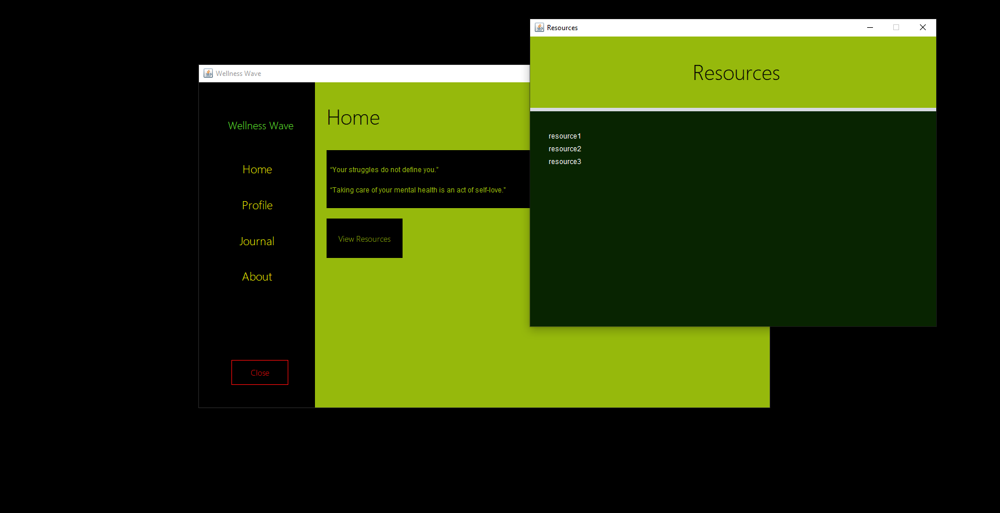
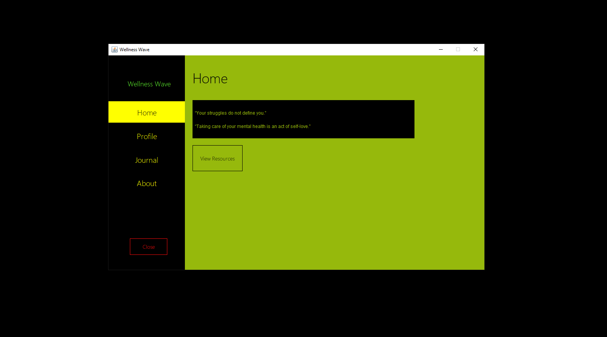
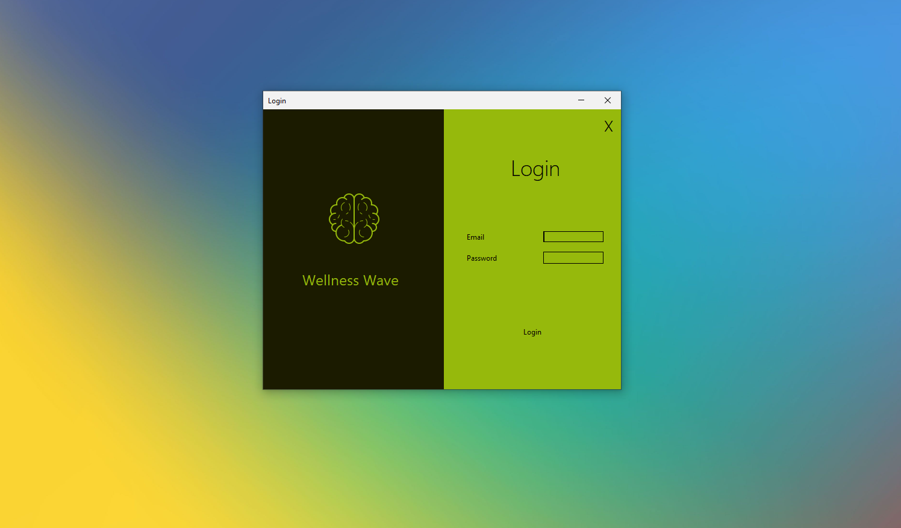
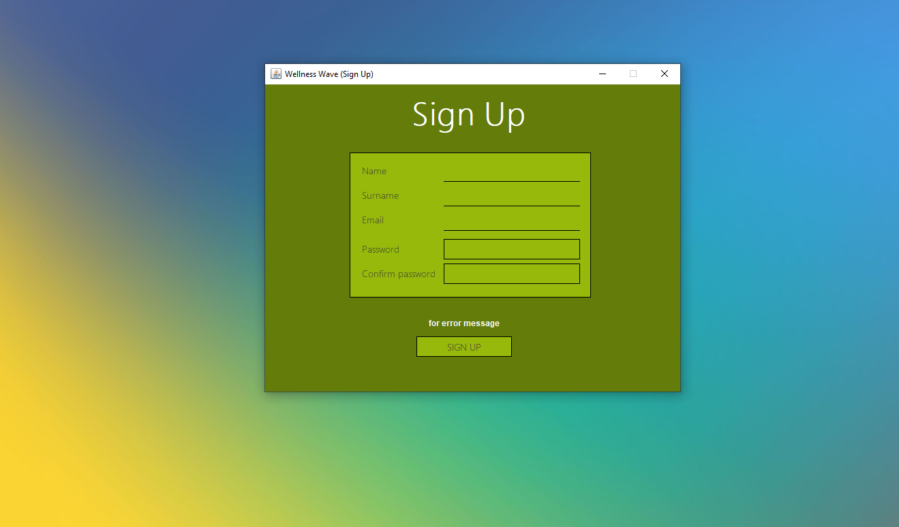
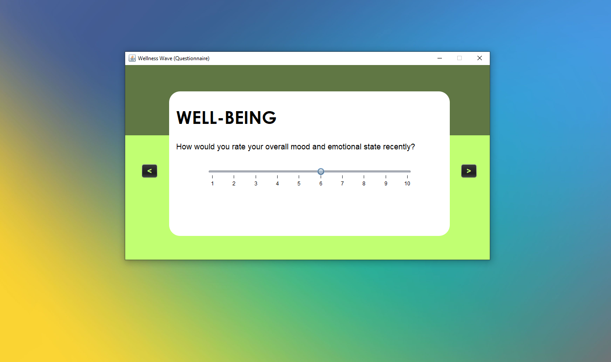

# Program:	Wellness Wave
__Description__ 	
_Desktop app to help people with mental-health challenges_
- Started:	06.05.24
- Updated: 	07.05.24
- Developers
	*  
	* [Joshua] ()
	* Princess
	* Kelsey-Jane
	* Caitlin
	* 

- Status:	work-in-progress
---
<!-- testing the comment -->

### More details about the application
- temp

### More notes
- temp

### Screenshots

